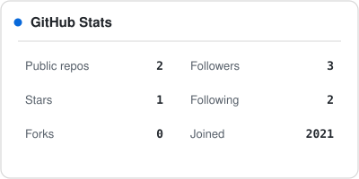
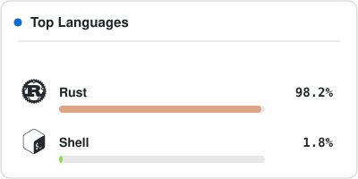

<h1 align="center">
  
</h1>

<h2 align="center">Joris Hummel</h2>

<em>CS student @ Karlstad University — software that lives in the browser, and software that lives in the terminal.</em>

  
  

---

### About

- 🔭 Currently building **[Matrix](https://github.com/ItzJoris03/matrix)** — a keyboard-driven dev engine and TUI written in Rust: manage local projects, cascading starts, declarative env injection, live logs.
- 🌱 Studying Computer Science at [Karlstad University](https://www.kau.se/utbildning/program-och-kurser/program/TGKDV).
- 💬 Daily drivers: **Rust, TypeScript, React, Node.js** — and whatever else breaks.

### Languages & Tools

  

### Stats

  <table>
    <tr>
      <td>
        <picture>
          <source media="(prefers-color-scheme: dark)" srcset="output/stats/stats-dark.svg" />
          
        </picture>
      </td>
      <td>
        <picture>
          <source media="(prefers-color-scheme: dark)" srcset="output/stats/langs-dark.svg" />
          
        </picture>
      </td>
    </tr>
  </table>
  <picture>
    <source media="(prefers-color-scheme: dark)" srcset="output/stats/streak-dark.svg" />
    
  </picture>

### Contributions

  <picture>
    <source media="(prefers-color-scheme: dark)" srcset="https://raw.githubusercontent.com/ItzJoris03/ItzJoris03/output/github-contribution-grid-snake-dark.svg" />
    <source media="(prefers-color-scheme: light)" srcset="https://raw.githubusercontent.com/ItzJoris03/ItzJoris03/output/github-contribution-grid-snake.svg" />
    
  </picture>

---

  
  
  

